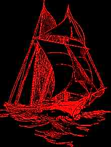
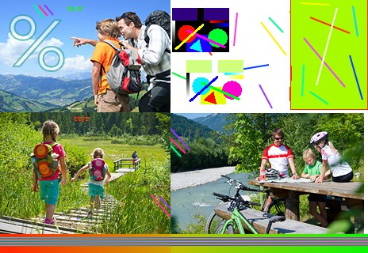
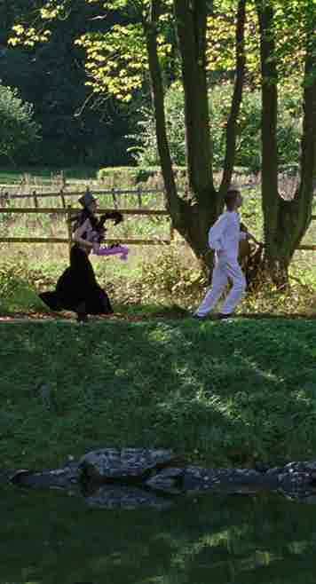
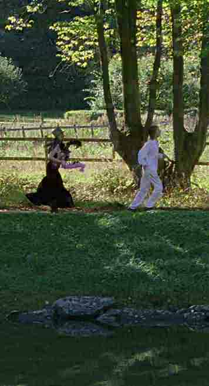

# Research JPEG encoder

Codename "Nether Poppleton"

----

The goal of this encoder is to produce files with best filesize/quality ratio, regardless of encoding speed or memory cost.

Experimental features:

* Luma-weighed chroma subsampling — thin red lines on white or black background don't become desaturated.
* Less aggressive DC quantization — less banding (but more blurriness) at very low qualities.
* Derining by overflowing — less noise around black text on white background.

## Usage

[**Download** binary](https://github.com/pornel/jpeg-compressor/releases) or compile with

    make

Run

    ./encoder source.png output.jpg 50

## Examples

These are *carefully chosen* examples that show certain improvements. They're not indicative of overall performance (and ImageMagick's JPEG encoder is generally okay).

### Deringing

JPEG shouldn't be used for line art, but people still do it. Now they can fail less at it.

ImageMagick = 7721B (left), this encoder = 7349B (right)

 

Deringing is implemented by overshooting the white color ([technique described here in detail](https://pornel.net/deringing)). This way distortions are introduced out of visible range.

#### Luma-from-chroma subsampling

Subsampling can be improved further by calculating new luma values based on chroma channels. This prevents errors such as out-of-range RGB values generated by naive subsampling.

Original (left), ImageMagick = 7277B (middle), this encoder = 7111B (right)

→ 

Unfortunately calculation of luma from chroma depends on knowing exactly how chroma is going to be decoded and upsampled in the decoder, but upsampling algorithm isn't part of the JPEG standard, and many decoders (old libjpeg, Apple's, Photoshop's) use not-so-great algorithms. Libjpeg-turbo does it well, so here's an image tuned for libjpeg-turbo:

Original:

With chroma subsampling: ImageMagick = 63545B (first),
this encoder = 63300B (second):

 

Note that with luma correction even colorful edges seem to have full resolution.

#### Low DC quantization

Standard JPEG encoders are not tuned for very low quality. Bad quality doesn't have to be *that* bad.

ImageMagick = 5033B (left), this encoder = 4890B (right)

 

This is done merely by tweaking quantization tables. Further improvements are possible.

----

## Not quite failed experiments

### Saturation-weighed subsampling

Eyes are less sensitive to color, so color channels are often saved at a lower resolution. However, poorly done subsampling causes darkened and desaturated halos around colorful edges.

Original (left), ImageMagick = 7277B (middle), this encoder = 7173B (right)

→ 

This is done by weighing chroma by luma level, so that blending of less saturated pixels with more saturated pixels results in more saturated pixels.

### Lossy RLE on DC

I've created algorithm for proper [unbiased lossy RLE compression](https://github.com/pornel/mediancut-posterizer/tree/rle) (I can make lossy BMP, lossy PCX and lossy IFF ILBM files!), and wanted to see if it could work when applied to JPEGs DC coefficients. It kinda does a bit, but it often becomes noticeable at 1% file size gain, so overall it may not be worth the effort. Here's a 7% improvement in file size (if you can't see the difference you're sitting too close to the monitor):

 

Grass and rocks at the bottom became flat and bland, but it's hard to see any difference in the trees. Any idea how to detect areas of the image that tolerate this degradation? I've tried looking for noisy areas based on amplitude of selected AC coefficients, but grass and trees have almost the same ACs.

## Failed experiments

### Blurring DC quantization

JPEG stores average brightness per each 8x8 block, and heavy compression reduces number of brightness levels available (DC quantization), causing obvious blockyness.

I've tried to apply blur that smoothes edges introduced by quantization. Here's an exaggreated example that looks nice:

 

Unfortunately with proper quantization tables there isn't enough fidelity in higher frequencies to make a difference, and bits spent on soft edges could as well be spent on better DC in a first place.
