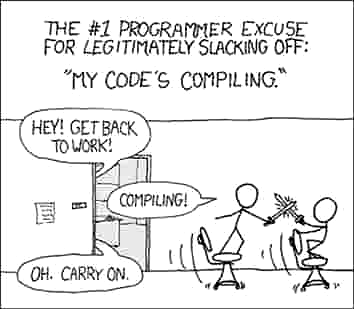
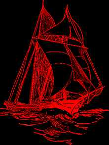
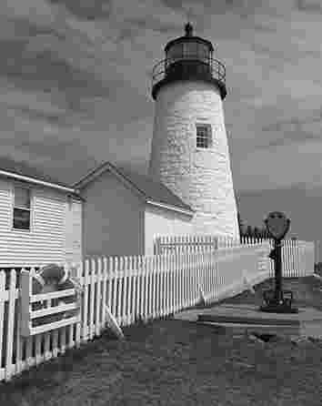
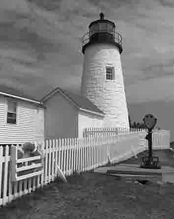
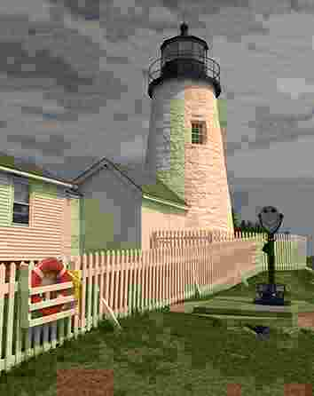

# Research JPEG encoder

Codename "Nether Poppleton"

----

The goal of this encoder is to produce files with best filesize/quality ratio, regardless of encoding speed or memory cost.

Experimental features:

* Luma-weighed chroma subsampling — thin red lines on white or black background don't become desaturated.
* Less aggressive DC quantization — less banding (but more blurriness) at very low qualities.
* Derining by overflowing — less noise around black text on white background.

## Usage

[**Download** binary](https://github.com/pornel/jpeg-compressor/releases) or compile with

    make

Run

    ./encoder source.png output.jpg 50

## Examples

These are *carefully chosen* examples that show certain improvements. They're not indicative of overall performance (and ImageMagick's JPEG encoder is generally okay).

### Deringing

JPEG shouldn't be used for line art, but people still do it. Now they can fail less at it.

ImageMagick = 7721B (left), this encoder = 7349B (right)

 

Deringing is implemented by overflowing white color (intensity used is 272 instead of 255). This way distortions are introduced out of visible range.

#### Subsampling

Color can be saved at half resolution. Poor subsampling darkens and desaturates red lines.

Original (left), ImageMagick = 7277B (middle), this encoder = 7173B (right)

→ 

This is done by weighing chroma by luma level. Needs further improvements to correct overall luminance.

#### Low DC quantization

Standard JPEG encoders are not tuned for very low quality. Bad quality doesn't have to be *that* bad.

ImageMagick = 5033B (left), this encoder = 4890B (right)

 

This is done merely by tweaking quantization tables. Further improvements are possible.

----

## Failed experiments

### Blurring DC quantization

JPEG stores average brightness per each 8x8 block, and heavy compression reduces number of brightness levels available (DC quantization), causing obvious blockyness.

I've tried to apply blur that smoothes edges introduced by quantization. Here's an exaggreated example that looks nice:

 

Unfortunately with proper quantization tables there isn't enough fidelity in higher frequencies to make a difference, and bits spent on soft edges could as well be spent on better DC in a first place.

